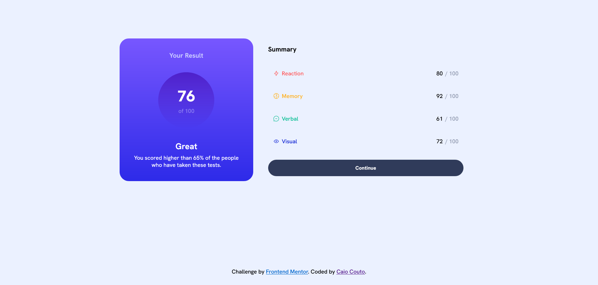

<h2 align="center">Frontend Mentor</h2>
<h1 align="center">Results summary component</h1>

**pt.** Esta é uma solução para o [Desafio Frontend Mentor - Componente de Exibição de Resultados](https://www.frontendmentor.io/challenges/results-summary-component-CE_K6s0maV). Os desafio do Fronted Mentor ajudam a aprimorar as habilidades de codificação à partir da construção de projetos reais.

**Para realizar este desafio, é preciso de, no mínimo, conhecimento básico de HTML e CSS.**

**en.** This is a solution to the [Results summary component challenge on Frontend Mentor](https://www.frontendmentor.io/challenges/results-summary-component-CE_K6s0maV). Frontend Mentor challenges help you improve your coding skills by building realistic projects. 

**To do this challenge, you need a basic understanding of HTML and CSS.**

---

## Índice (Table of contents)

- [Visão geral (Overview)](#geral)
  - [Screenshot](#screenshot)
  - [O desafio (The challenge)](#o-desafio)
    - [Usuários devem (Users must)](#usuarios-deve)
    - [Onde encontrar tudo (Where to find)](#onde-achar)
  - [Links](#links)
  - [Built with](#built-with)
- [Author](#author)

---

## Visão geral (Overview)

### Screenshot

---

### O desafio (The challenge)

**pt.** O desafio consiste em construir um componente de exibição de resultados o mais parecido possível com o design fornecido. Pode-se utilizar de quaisquer ferramentas que desejar para completá-lo.

Os dados, caso queira tornar as coisas mais dinâmicas, podem ser encontrados no arquivo local `data.json`.

**en.** The challenge is to build out this results summary component and get it looking as close to the design as possible.You can use any tools you like to help you complete the challenge.

It is provided the data for the results in a local `data.json` file. So you can use that to add the results and total score dynamically if you choose.

#### Os usuários devem ser capazes de (Users should be able to):

**pt.**
- Visualizar a página com o layout otimizado para a tela dele.
- Ver os efeito de *hover* e *focus* para os elementos interativos.

**en.**
- View the optimal layout for the interface depending on their device's screen size
- See hover and focus states for all interactive elements on the page

#### Onde encontrar tudo (Where to find everything)

**pt.** A tarefa do projeto consiste em construir um componente baseado nos designs encontrados dentro da pasta `/design`. Lá, estão os designs de layouts tanto para *desktops* quanto *mobiles*, em formato JPG. O que significa que é necessário utilizar de bom sendo para estilos como `font-size`, `padding` e `margin`.

Todos os *assets* necessários estão na pasta `/assets`. As iamgens já estão exportadas e otimizadas para os tamanhos de tela corretos.

Também há o arquivo `style-guide.md`, que contém as informações necessárias para estilização, como fonte desejada e paleta de cores.

**en.** Your task is to build out the project to the designs inside the `/design` folder. You will find both a mobile and a desktop version of the design, in JPG static format. Which means that you'll need to use your best judgment for styles such as `font-size`, `padding` and `margin`.

All the required assets for this project are in the `/assets` folder. The images are already exported for the correct screen size and optimized.

There is also a `style-guide.md` file containing the information you'll need, such as color palette and fonts.

---

### Links

[Preview on GitHugb Pages](https://caiocouto.github.io/frontend-mentor-results-summary-component/)

---

### Como foi feito (How it was done)

*pt.*
- HTML semântico 
- CSS
    - Flexbox
- Pensamento Mobile-first
- Javascript

*en.*
- Semantic HTML. 
- CSS
    - Flexbox
- Mobile-first workflow
- Javascript

---

## Author

- Caio Couto
- Frontend Mentor - [@CaioCouto](https://www.frontendmentor.io/profile/CaioCouto)
